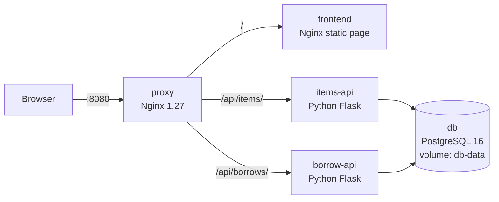

# LabLend: Lab Equipment Borrowing System

A small multi-module demo app used to show **containerized infrastructure** (Docker, Docker Compose) and **CI/CD automation** (Jenkins). A `git push` to `main` automatically tests, builds, and deploys the whole stack.

## Architecture



All containers share the user-defined network `lablend-net`. Only the proxy publishes a port (8080). The database is never exposed to the host.

```
Developer --git push--> GitHub <--polls every minute-- Jenkins (localhost:8081)
Jenkins: Checkout > Test (pytest in Docker) > Build Images (tag = build #) > Deploy > Smoke Test
```

## Modules

| Container | Technology | Purpose |
|---|---|---|
| proxy | Nginx 1.27 (Alpine) | Single entry point; routes `/`, `/api/items/`, `/api/borrows/` |
| frontend | HTML/JS on nginx-unprivileged | Equipment list, add form, borrow/return; shows build number |
| items-api | Python 3.12, Flask, Gunicorn | CRUD for lab equipment |
| borrow-api | Python 3.12, Flask, Gunicorn | Borrow/return records, computes due date (3-day loan) |
| db | PostgreSQL 16 (Alpine) | Data in named volume `db-data` |
| jenkins (separate compose) | Jenkins LTS + Docker CLI | CI/CD server |

## Run it locally

```bash
cp .env.example .env          # then edit DB_PASSWORD
docker compose up -d --build
# open http://localhost:8080
```

## Start Jenkins

```bash
cd infra/jenkins
docker compose up -d --build
docker exec jenkins cat /var/jenkins_home/secrets/initialAdminPassword
# open http://localhost:8081
```

Pipeline trigger: **Poll SCM every minute** (declared in the `Jenkinsfile`). The real `.env` is stored in Jenkins as a *Secret file* credential with ID `lablend-env`.

## Rollback

```bash
docker images lablend/frontend          # see which build numbers exist
TAG=5 docker compose up -d --no-build   # PowerShell: $env:TAG="5"; docker compose up -d --no-build
```

## Team

| Role | Member |
|---|---|
| Project Lead / Scrum Master | |
| DevOps / CI-CD Engineer | |
| Infrastructure Engineer | |
| Backend and Database Engineer | |
| Frontend, QA, and Documentation Lead | |
